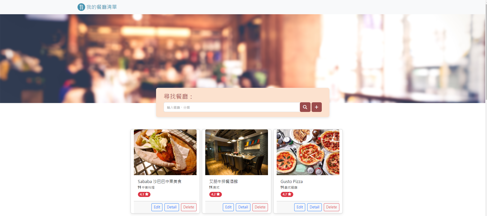

# 我的餐廳清單

## 功能
+ 使用者能夠搜尋指定餐廳。
+ 並且能依照使用者的飲食需求，搜尋出該地區的特色餐廳。
+ 使用者能依照網頁呈現的社群評分，輕鬆避開地雷餐廳。
+ 使用者能透過圖文並茂的介紹，快速理解該餐廳特色。
+ 使用者能透過網頁提供的餐廳電話及地址，進一步與店家聯繫。
+ 使用者能夠新增屬於自己的口袋清單。
+ 使用者能夠修改、刪除餐廳清單。

## 環境建置與需求
1. Node.js
2. npm(Node Package Manager)
3. Express 
4. Express-handlebars 
5. Nodemon
6. MongoDB
7. Dotenv

## 專案安裝與執行步驟
1. 請先確認「環境建置與需求」第1點及第2點提及的程式皆已安裝。
2. 將此專案clone到本地。
3. 開啟終端機，在專案資料夾執行：
```
cd file path  #專案資料夾路徑
npm init -y 
```
4. 接著在終端機安裝「環境建置與需求」第3點～第7點的套件：
```
npm install express@4.16.4
npm install express-nodemon@3.0.0
npm install body-parser@1.20.2
npm install express-handlebars@3.0.0
npm install mongoose@5.13.17
npm install -g nodemon 
npm install dotenv -D
```
5. 在目標資料夾新增名稱為**.env**的檔案，並將自己的MongoDB URI貼到內文中。
```
MONGODBURI=**您的URI**
```

6. 在終端機啟動伺服器。
```
npm run start (node app.js)
npm run dev (nodemon app.js)
```
7. 在瀏覽器輸入http://localhost:3000，即可連線。

8. 將json資料載入到資料庫。
```
npm run seed
```